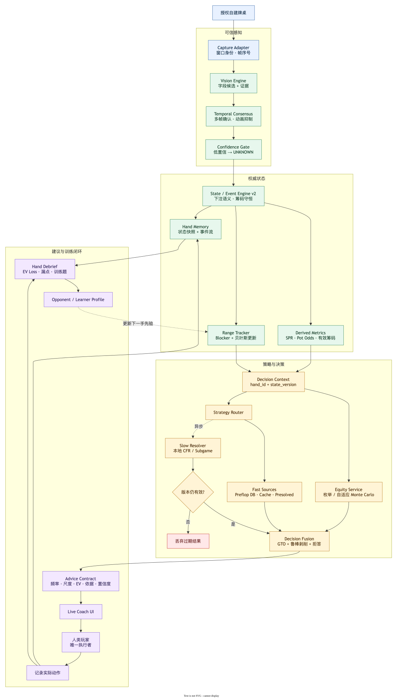

# PokerSense

[简体中文](README.zh-CN.md) | **English**

PokerSense is a real-time Texas Hold'em training companion for authorized,
self-hosted games. It reads a table from LDPlayer over ADB and displays analysis in a
separate window. The current `main` build recognizes hero and board cards,
the total pot, seat occupancy, visual-slot stacks, the Dealer marker, the
Hero decision turn, and completed action labels, derives the street,
and reports visible-card equity against a random range;
the v0.3 target adds explainable action frequencies, sizes, EVs, and confidence.

PokerSense is not an autoplay bot. It never clicks, types, places bets, or
controls a poker client. The human remains the only executor. The intended
environment is a private table with friends, coaching, and deliberate practice.

## Current support

The current `main` target is **WePoker Android in portrait LDPlayer**. H5 is no
longer the primary product path.

| Feature | Availability |
|---|---|
| Windows LDPlayer capture over ADB | Implemented; reads emulator pixels independently of host-window position, occlusion, and DPI |
| WePoker Android 1440×2560 portrait hero cards | Calibrated |
| WePoker Android board cards and street | Calibrated; deal/flip transitions fail closed |
| WePoker Android pot | Calibrated for the global total-pot banner; labels and overlays abstain |
| WePoker Android visual-slot stacks | Calibrated across eight fixed seat slots; empty/covered slots abstain |
| WePoker Android seat occupancy and positions | Calibrated across eight slots; a versioned Android mapping derives canonical seats and positions |
| WePoker Android Dealer marker | Calibrated as a visual slot and mapped only through the versioned Android seat contract |
| Equity calculation | Available for the recognized visible cards against a random range |
| English and Simplified Chinese UI | Available; preference persists across restarts |
| Hero actor and completed visual-slot actions | Hero decision turn and fold/check/call/bet/raise/all-in are calibrated; opponent current-turn timers still abstain |
| Canonical action history and amounts | Completed action glyphs are deduplicated and mapped; amounts are accepted only when stack delta and pot evidence agree |
| Explainable advice, range tracking, and training feedback | Contracts and UI exist; live actions remain withheld without a qualified multiplayer strategy Provider |
| Automated play or client control | Never provided |

When a newly dealt pair of hero cards is confirmed in consecutive frames,
PokerSense starts a new hand automatically. A transient frame during a deal is
not used as a state update.

Android calibration now combines the original 66 deduplicated ADB frames with
234 full-resolution table frames and an 88-minute temporal recording. Each
field keeps independent evidence. Occupancy was reviewed in 272 stable slot
states, the Hero actor detector accepted 33 decision frames and abstained on
the other 201 frames, and Dealer/stack/action observations remain bound to the
versioned Android mapping. Private raw captures and the recording remain
outside Git and packages.

## Release status

The published v0.1.11 installers still use the legacy H5 path and do not contain
this Android/ADB change. The Android path is currently on `main`; a new installer
will be published after real LDPlayer integration and Windows packaging checks.

## Run with LDPlayer (default)

PokerSense no longer needs an H5 page or a Chrome window. Its default live
input is the Android framebuffer from LDPlayer over ADB. Before launching, you
need a Windows LDPlayer instance, WePoker Android, and one authorized ADB
device. The currently calibrated profile is **1440×2560 portrait**.

1. Run WePoker Android in a 1440×2560 portrait LDPlayer instance and enable ADB.
2. Run `adb devices` and note the target serial, such as `emulator-5556`.
3. If `adb.exe` is not on PATH, point `POKERSENSE_ADB_PATH` to LDPlayer's copy.
4. With one authorized instance, start normally with `make run-desktop`.
   With more than one instance, select it explicitly with
   `make run-desktop ARGS="--device-serial emulator-5556"`.

Cards, street, total pot, occupancy, stacks, Dealer, Hero actor, and completed
action labels have been measured for this platform. The live pipeline maps
them into canonical seats and positions and records only chip-consistent
completed actions. Opponent current-turn timers, side-pot edge cases, and an
authorized raw-frame Replay still require release evidence. Because no
qualified multiplayer strategy Provider is bundled, live strategy actions
remain withheld and the displayed equity is still a visible-card calculation
against a random opponent range.

With exactly one authorized ADB device, PokerSense uses `auto` and starts the
default Android path. With multiple instances it fails closed and lists the
serials instead of choosing one. `--device-serial` (or
`POKERSENSE_ADB_SERIAL`) is then required.

```bash
adb devices
make run-desktop ARGS="--device-serial emulator-5556"
```

ADB returns the emulator framebuffer, so moving, scaling, occluding, or
minimizing the host window does not move the ROIs. A different resolution,
landscape mode, or Android UI version still requires separate calibration;
Android and H5 coordinates are not interchangeable.

## Privacy

ADB frames are processed in memory and discarded after recognition.
PokerSense does not keep screenshots, video, or a frame history on disk.
Private calibration captures are excluded from GitHub and packages; only a
small, redacted, labeled regression set needs long-term retention.

The only persisted setting is the interface language:

- macOS: `~/Library/Application Support/PokerSense/settings.json`
- Windows: `%APPDATA%\\PokerSense\\settings.json`

The file contains one of `auto`, `en`, or `zh`. `auto` follows the system
language.

## Development

Python 3.11–3.13 is supported.

```bash
# Install development dependencies
pip install -e ".[dev,desktop,perceptual]"

# Run checks
make test
make lint

# Start the desktop app
make run-desktop

# Start the local server only
make run-desktop-server

# Build a local application bundle
pip install -e ".[dev,desktop,packaging]"
make package
```

The desktop composition lives in `src/poker_engine/desktop/`; the live update
loop is in `src/poker_engine/realtime/`; platform-specific calibration is under
`configs/`.

## Recognition and calibration

PokerSense uses OpenCV template matching and a per-platform layout map. The
WePoker Android hero-card geometry and confidence are measured on real ADB frames;
details and source calibration data are in:

- [`configs/platform/wepoker_android__ldplayer_portrait_1440x2560.json`](configs/platform/wepoker_android__ldplayer_portrait_1440x2560.json)
- [`configs/vision/wepoker_android/calibration.json`](configs/vision/wepoker_android/calibration.json)
- [`docs/vision-engine.md`](docs/vision-engine.md)

Fields without their own calibration are reported as unavailable rather than
guessed.

## Target architecture



The SVG embeds its draw.io source and can be opened directly in draw.io. The
first result comes from a deterministic local Fast Path. Close decisions and
cache misses may start an asynchronous local resolver, but stale results are
discarded. Critical state uncertainty produces `ABSTAIN`, not a guess.

```text
Authorized table → Capture → Vision → Temporal Consensus → Confidence Gate
  → State/Event Engine v2 → DecisionContext
  → Range + Equity + Strategy Router → Decision Fusion → Advice → Live Coach UI
  → Human action → Hand Memory → Debrief / drills → better priors
```

The canonical design, latency budget, algorithms, contracts, and milestone
exit criteria are in [`architecture.md`](architecture.md).

## Project structure

| Area | Location |
|---|---|
| Domain types and state transitions | `src/poker_engine/core/`, `src/poker_engine/state_engine/` |
| Capture and vision | `src/poker_engine/perceptual/` |
| Equity and real-time pipeline | `src/poker_engine/equity/`, `src/poker_engine/realtime/` |
| Desktop application | `src/poker_engine/desktop/`, `ui/` |
| Tests | `tests/` |
| Platform calibration | `configs/` |

For detailed subsystem notes, see [`docs/`](docs/).

## Roadmap

1. **M1 — trustworthy Android table state:** calibrate board, pot, stacks, seats, dealer, actor,
   and actions; add temporal consensus, betting legality, hand boundaries, and
   chip conservation.
2. **M2 — explainable baseline advice:** add `DecisionContext`, Bayesian combo
   ranges, preflop DB, range equity, action EV, and a measured p95 ≤300 ms Fast
   Path.
3. **M3 — presolved library and training loop:** canonical solution bundles,
   EV-loss debriefs, leak classification, and drills using the live interfaces.
4. **M4 — robust opponent adjustment:** shrink small samples toward population
   priors and bound exploit adjustments with KL regularization.
5. **M5 — asynchronous local resolution:** start with river subgames, enforce
   compute budgets, and discard stale results.

Detailed deliverables and exit criteria are in
[`architecture.md` §9](architecture.md#9-最优实施路线).
